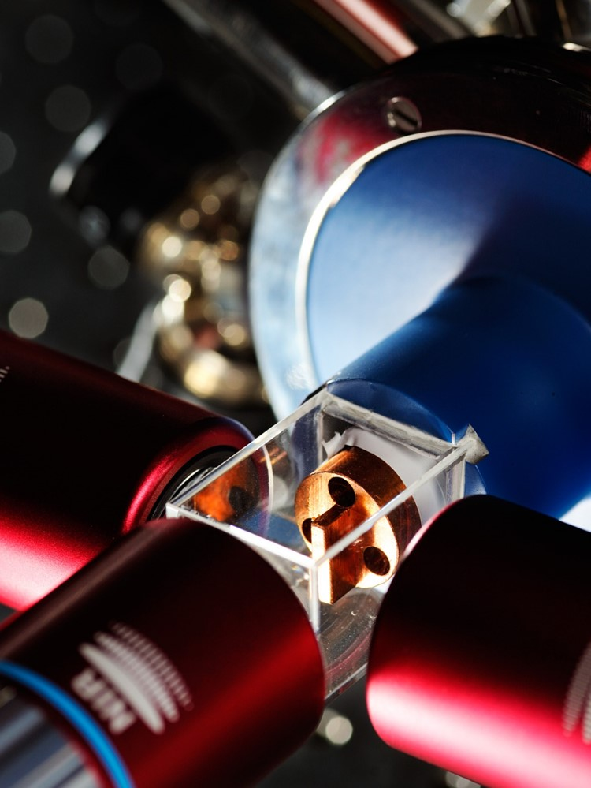

## Motivation

Metal fuel particles can agglomerate under high-temperature conditions, which changes the effective surface area, reaction rate, and transport behavior.

- This sample deck uses the TU/e Beamer format from the extension.
- Theme setup is handled through `_includes/tue-theme.tex`.
- Use regular Quarto Markdown (`##`) to create additional slides.

## Example Analysis

:::: columns
::: {.column width="58%"}
### Key points

- Agglomeration changes the particle size distribution.
- Optical diagnostics and post-processing can be summarized on one slide.
- Equations render with standard LaTeX math support.

$$
\tau = \frac{d_p^2}{18 \nu}
$$
:::

::: {.column width="42%"}
{fig-alt="Sample image" width=100%}
:::
::::

## Roadmap

1. Experimental setup
2. Image-based agglomerate metrics
3. Model comparison and sensitivity

## Next Steps

1. Adjust the theme and department in `_includes/tue-theme.tex`.
2. Add your real content as regular `##` slides.
3. Render with `quarto render presentation-beamer.qmd`.
